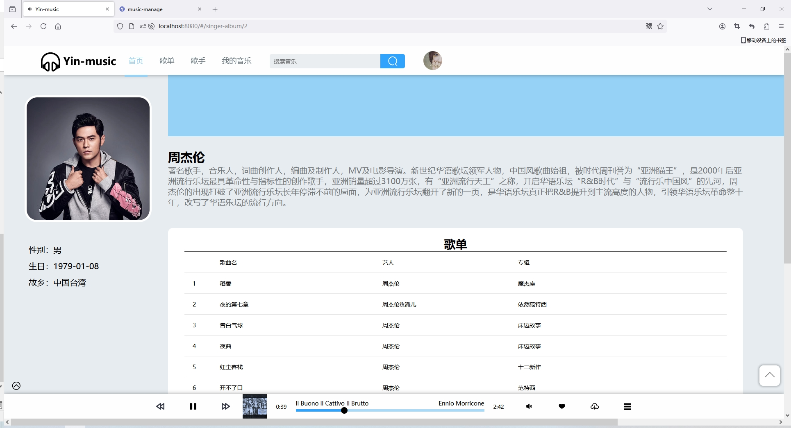
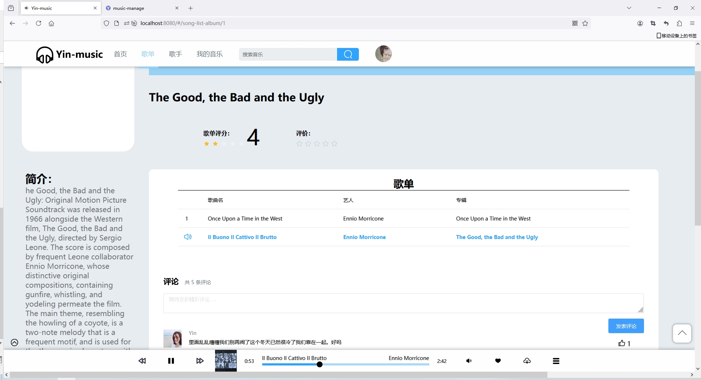
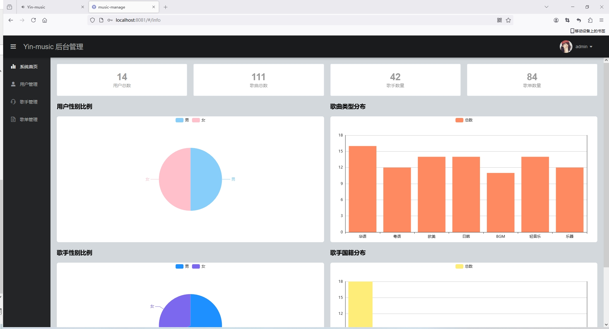
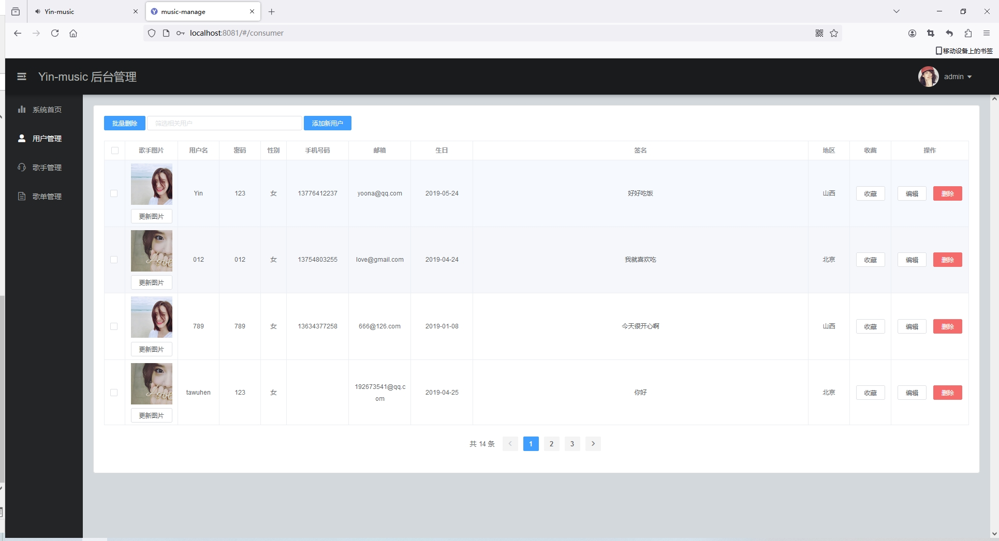
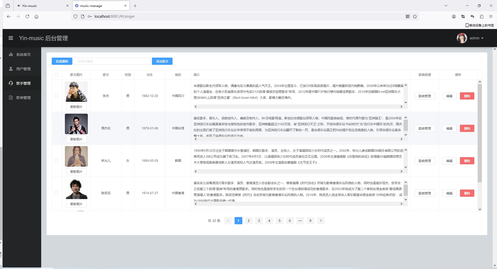
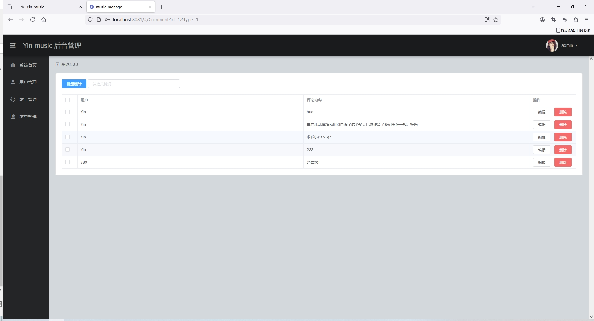

<h1 align="center">基于SpringBoot+vue框架实现的音乐网站</h1>

<h4> 完整代码获取地址：从戎源码网（https://armycodes.com/） </h4>
<h4> 作者微信：19941326836 QQ：605739993 QQ群：655392706 </h4>
<h4> 承接计算机毕设、Java毕业设计、Python毕业设计、深度学习、机器学习 </h4>
<h4> 选题+开题报告+任务书+程序定制+安装调试+论文+答辩ppt 一条龙服务 </h4>
<h4> 毕业设计所有选题地址：(https://github.com/Descartes007/allProject) </h4>

## 项目介绍

基于SpringBoot+vue框架实现的音乐网站：前端 vue、axios、elementui，后端 springboot、mybatis，系统角色分为：管理员和用户，管理员在管理后台对用户信息、歌手信息、歌单信息管理等；用户可以听歌、收藏歌曲、下载等。主要功能如下：

### 管理员

- 基本操作：登录、上传图像、查看个人信息
- 用户管理：获取用户列表、查看用户详情、删除用户信息、添加新用户、筛选用户信息、收藏用户信息、修改用户信息
- 歌手管理：获取歌手列表、查看歌手详情、删除歌手信息、添加新歌手、筛选歌手信息、歌曲管理、修改歌手信息
- 歌曲管理：获取歌曲列表、查看歌曲详情、删除歌曲信息、添加新歌曲、筛选歌曲信息、修改歌曲信息、更新图片、上传歌曲、评论歌曲、上传歌词、播放歌曲、获取评论列表、删除评论、修改评论信息、筛选评论
- 歌单管理：获取歌单列表、查看歌单详情、删除歌单信息、添加新歌单、筛选歌单信息、修改歌单信息、更新图片、评论歌单、上传歌词、获取歌单列表、筛选歌单歌曲、删除歌单歌曲、获取评论列表、删除评论、修改评论信息、筛选评论
- 统计：用户性别统计、歌曲类型分布统计、歌手性别统计、歌手国籍统计、用户数量统计、歌曲总数统计、歌手数量统计、歌单数量统计

### 用户

- 基本操作：登录、注册、上传图像、修改个人信息、查看个人信息
- 歌曲模块：获取歌单列表、查看歌单详情、评论歌单、点赞评论、获取评论列表、评价歌单、播放歌曲、获取歌曲类型、收藏歌曲、下载歌曲、查看播放列表
- 歌手模块：获取歌手列表、查看歌手详情、获取专辑列表

## 环境

- <b>IntelliJ IDEA 2020.3</b>

- <b>Mysql 5.7.26</b>

- <b>Maven 3.6.3</b>
  
- <b>NodeJs 14.17.3</b>

- <b>JDK 1.8</b>

## 运行截图

